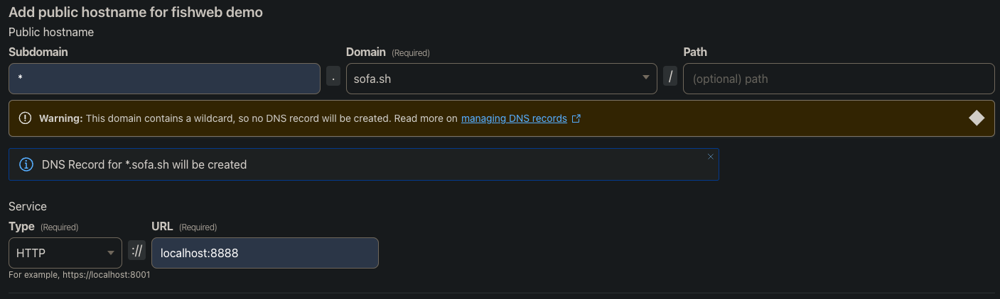
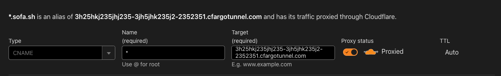
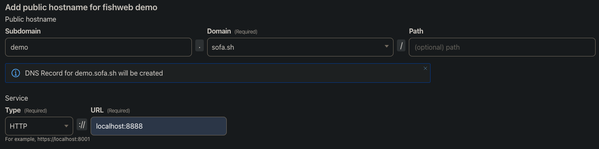

# Cloudflared

With Cloudflare Tunnels you can expose your local server to the internet.

## Setup

1. Make sure you own a domain and it's connected to cloudflare.
2. From your site's dashboard, navigate to `Access > Networks > Tunnels`.
3. Click `Create a tunnel` and select `Cloudflared`.
4. Give it a name and install the connector.

### Wildcard

Using a wildcard will allow you to map all apps in your fishweb root folder to a subdomain for your domain.
This makes it easier to quickly setup a subdomain for new apps.

5. Add `*` as the subdomain and select your domain. Then set origin service.

6. Go back to the DNS configuration and create a new `CNAME` record. With name `*` and target `<tunnel-id>.cfargotunnel.com`.

### Specific App

If you don't want all your fishweb apps to be accessible via your domain you can set a specific subdomain for an app.

5. Here instead of using a wildcard subdomain put the name of your app's folder.

